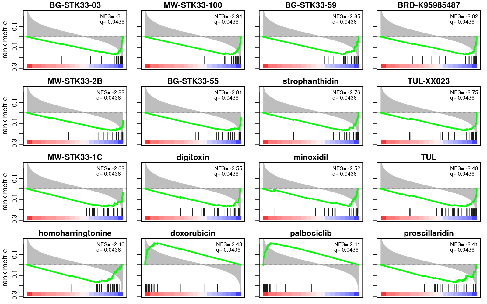

```{r, include = FALSE}
knitr::opts_chunk$set(
  collapse = TRUE,
  comment = "#>"
)
```

## INTRODUCTION

SpaceLINCS calculates and visualizes the correlation between your
experimental gene expression profile with perturbations signatures
from the [LINCS L1000](https://lincsproject.org/LINCS/) drug
connectivity map. Summarizing the analysis with these perturbation
databases is difficult because they consist of over a million of
profiles, mixing different cell lines and varying treatment
concentrations. SpaceLINCS attempts to efficiently calculate and
simplify the results by performing stratified enrichment tests on the
connectivity scores. In this way, mechanism-of-action or gene targets
are easily evident from the analysis.

SpaceLINCS combines rank correlation and GSEA (gene set enrichment
analysis) to identify comprehensive analysis at the individual
perturbagen level and, in the case of drugs, at the mode-of-action
(MOA). SpaceLINCS proposes a novel approach to correlate perturbation
signatures, rather than providing outputs for each perturbation
experiment individually, it performs additional GSEA steps on the
output based on the ranked correlation scores for each
compound. Finally it executes another GSEA steps to infer the
mechanism-of-action (MoA) by combining individual compounds into drug
class and target gene. The method considerably simplifies the
interpretation of the results of perturbation databases that have
repetition of experiments under similar but not identical conditions
(e.g. different drug concentrations or different cell lines), such as
the LINCS L1000 connectivity map (Duan et al, 2014).


## INSTALLATION

You can install the development version of SpaceLINCS from
[GitHub](https://github.com/) with:


```{r}
#install.packages("remotes")
remotes::install_github("bigomics/SpaceLINCS")
```

## Computation method

The method of computing the perturbation enrichment, is based on two
major calculation steps. First, we calculate the rank correlation
between the fold change values of the experimental matrix and the fold
change of genes under various perturbagens (obtained from the LINCS
L1000 database). Then, we calculate the enrichment using GSEA method,
where the previously computed correlation coefficients are used as
ranking metric to perform a GSEA across all the datasets for a given
perturbagen.

```{r}
## source code within computeConnectivityEnrichment function, do not
## run it, it is for method illustration not part of the workflow

##  fist calculation of rank correlation 
gg   <- intersect(rownames(mDrugEnrich), rownames(mFC))
rnk1 <- apply(mDrugEnrich[gg, , drop = FALSE], 2, rank, na.last = "keep")
rnk2 <- apply(mFC[gg, , drop = FALSE], 2, rank, na.last = "keep")
R1   <- stats::cor(rnk1, rnk2, use = "pairwise")

# Then, we calculate the perturbation enrichment using GSEA
xdrugs <- gsub("[@_].*$", "", colnames(mDrugEnrich))
meta.gmt <- tapply(colnames(mDrugEnrich), xdrugs, list)
res <- list()
for (i in 1:ncol(R1)) {
   suppressWarnings(res[[i]] <- fgsea::fgseaSimple(meta.gmt, stats = R1[, i], nperm = 1000))
}
```

Important to note is that the GSEA plot in this case, instead of
showing ranked genes, shows the sorted correlation between the
experiment of interest and each individual dataset in the present of a
given perturbagen (Fig. 1), and the Enrichment Score (ES) indicates
the presence of an enriched positive or negative correlation (or
'connectivity') between the cumulative list of experiments for a given
perturbagen and the test profile.

![(A-B) Two GSEA plots showing a positively (A) and negatively (B) correlated profile based on the correlation scores of individual drug profiles (green boxes) with a test profile; individual black bars denote ranks based on the correlation coefficients for all experiments corresponding to a particular drug (here palbociclib and strophanthidin). The package correlates a test signature with known drug profiles from one of the selected databases such as(L1000, GDSC, CTRP) and shows similar or opposite profiles by running the GSEA algorithm on the drug profile correlation space. (C) Barplot displaying the most enriched compound MoAs. On the vertical axis, the GSEA normalized enrichment score of the MoA class is plotted. (D) Barplot displaying the most enriched target genes. On the vertical axis, the GSEA normalized enrichment score of the gene target is plotted. (E) An activation matrix showing the most positively or negatively correlated perturbagens across all test profiles. The size of the circles correspond to their relative activation, and are colored according to their upregulation (red) or downregulation (blue) in the contrast profile.](images/1.png "Visual outputs of the package"){width="800"}


## SpaceLINCS Objects

SpaceLINCS consists of a group of functions and included datasets
provided in the package.

### Data objects in SpaceLINCS

#### Fold change matrix (mFC)

Fold change matrix of differential gene expression from RNAseq data of
a multiple myeloma study (Logie et al 2021). They compared the
therapeutic efficacy of the phytochemical kinase inhibitor withaferin
A with the clinically approved BTK inhibitor ibrutinib to target
hyperactivated tyrosine kinase signaling in glucocorticoid-resistant
multiple myeloma cells. The results demonstrate that withaferin-A
induced cell death of glucocorticoid-resistant MM1R cells involves
covalent cysteine targeting of multiple Hinge-6 domain type tyrosine
kinases of the kinase cysteinome classification, including BTK.

```{r}
load(system.file("data","mFC.rda", package = "SpaceLINCS"))
```

#### Annotation of drugs (DrugsAnnot)

This dataset is a matrix represents the drugs annotation that contains
drug names, targets, mechanism of action , clinical phase, disease
area, and indication. This annotation was retrieved from the LINCS
L1000 database.

```{r}
load(system.file("data","DrugsAnnot.rda", package = "SpaceLINCS"))
```

#### The drugs activity matrix (mDrugEnrich)

This large matrix represents relative gene expression fold change of
1001 genes corresponding to 20220 different molecular perturbation
experiments. The LINCS L1000 project has collected gene expression
profiles for thousands of perturbagens at a variety of time points,
doses, and cell lines. A full list of the chemical and genetic
perturbations used can be found on the CLUE website along with their
descriptions.

```{r}
load(system.file("data","mDrugEnrich.rda", package = "SpaceLINCS"))
```

### SpaceLINCS Functions

The SpaceLINCS package provides three categories of important
functions: computeConnectivityEnrichment(), computeMoaEnrichment() and
some plotting functions. The following illustrates each function in
the package in a typical analysis workflow.

## The workflow

### Loading the example data

Within the package there are three R data objects .rda, the user can
load them as is shown in the previous section. Inspect them with:

```{r}
print("the fold change matrix:.....")
head(mFC)
print(" the drugs annotation dataframe:.......")
head(DrugsAnnot)
print(" the drugs activity large matrix:.....")
mDrugEnrich[1:5,1:5]
```

### Calculation the drug enrichment with computeConnectivityEnrichment()

Calculate the rank correlation between the tested gene expression
profile and other datasets signatures in the presence of a given
perturbagen, based on database and annotation which is provided to the
function.

```{r message=FALSE, warning=FALSE, paged.print=FALSE}
res <- computeConnectivityEnrichment(mFC, nprune=0)
names(res)
```

The `res` object contains 6 elements, matrices `X`, `P` and `Q`,
correspond to the enrichment coefficient, the pvalue and the q-value
for all contrasts. The `size` vector denotes the size of the drug set
(number of replicates). The `stats` matrix is the ranking metric
(connectivity or rank correlation coefficients) the tested expresssion
profile with the perturbation profiles. The `drug` object annotates
the ranking metric with a first level of drug annotation.

### Select/view drug set enrichment object using selectResult()

The `res` object contains the results for all contrasts. If you have
specified more than one contrast, you can extract the results for a
particular contrast using `selectResult(res,i)`. The resulting table
summarizes the enrichment statistical values (`drug`: drug's name,
`NES`: normalized enrichment score, `pvalue`, `padj`: adjusted pvalue
with Benjamini-Hochberg correction.)

```{r}
res1 <- selectResult(res,1)
View(res1)
```

### Compute the mechanism-of-action enrichment computeMoaEnrichment()

`computeMoaEnrichment()` is used to compute the mechanism-of-action
enrichment of drug class and target gene of the drugs.

```{r}
moa <- computeMoaEnrichment(res) 
names(moa)

## Get the mechanism of action results for the first contrast
head(moa[[1]]$drugClass)
head(moa[[1]]$targetGene)
```

### Plot the drugs connectivity using plotDrugConnectivity()

`plotDrugConnectivity()` plots the drug connectivity ad GSEA plot for
the top 16 drugs.

```{r}
## Plot the drugs connectivity using plotDrugConnectivity()
plotDrugConnectivity(res, contr=1)
```

{width="559"}

### Plot the mechanism of action using plotMOA()

The function plotMOA() plots mechanism of action the top 16 enriched
drugs.

```{r}
## Plot the mechanism of action using plotMOA()
plotMOA(moa, contr=1, type="drugClass", ntop=20)
plotMOA(moa, contr=1, type="targetGene", ntop=20)
```

{width="607"}
{width="607"}

### Plot the drug activity map using plotActivationMap()

This plot shows the most positively or negatively correlated
perturbagens across all test profiles. The size of the circles
correspond to their relative activation, and are colored according to
their upregulation (red) or downregulation (blue) in the contrast
profile.

```{r}
## Plot the drugs activity map using dseaPlotActmap()
plotActivationMap(res, nterms = 60, nfc=20)
```


