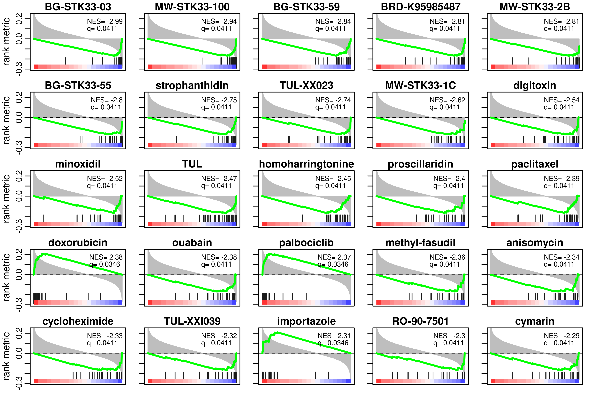
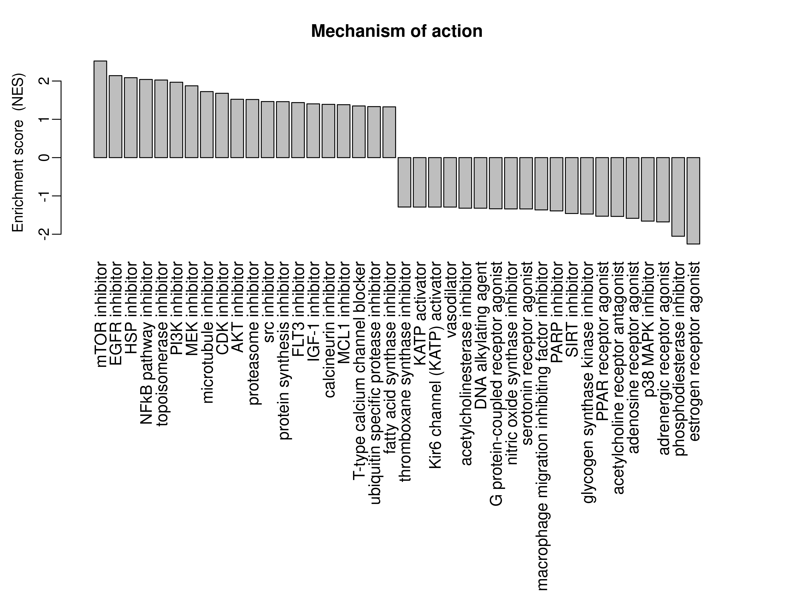
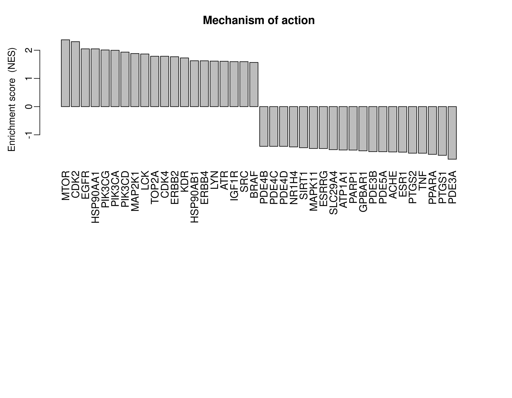

```{r, include = FALSE}
knitr::opts_chunk$set(
  collapse = TRUE,
  comment = "#>"
)
```

## Introduction

metaLINCS calculates and visualizes the correlation between your
experimental gene expression profile with perturbations signatures
from the [LINCS L1000](https://lincsproject.org/LINCS/) drug
connectivity map. Summarizing the analysis with these perturbation
databases is difficult because they consist of over a million of
profiles, mixing different cell lines and varying treatment
concentrations. metaLINCS attempts to efficiently calculate and
simplify the results by performing stratified enrichment tests on the
connectivity scores. In this way, mechanism-of-action or gene targets
are easily evident from the analysis.

## Installation

You can install the development version of metaLINCS from
[GitHub](https://github.com/) with:


```{r, eval=FALSE, echo=TRUE}
install.packages("remotes")
remotes::install_github("bigomics/metaLINCS")
```

## Computation method

metaLINCS combines rank correlation and GSEA (gene set enrichment
analysis) to identify comprehensive analysis at the individual
perturbagen level and, in the case of drugs, at the mode-of-action
(MoA). metaLINCS proposes a novel approach to correlate perturbation
signatures, rather than providing outputs for each perturbation
experiment individually, it performs additional GSEA steps on the
output based on the ranked correlation scores for each
compound. Finally it executes another GSEA steps to infer the
mechanism-of-action (MoA) by combining individual compounds into drug
class and target gene. The method considerably simplifies the
interpretation of the results of perturbation databases that have
repetition of experiments under similar but not identical conditions
(e.g. different drug concentrations or different cell lines), such as
the LINCS L1000 connectivity map (Duan et al, 2014).

The method of computing the perturbation enrichment, is based on three
major calculation steps. First, for the so-called first level
'connectivities', we calculate the rank correlation between the fold
change values of the experimental matrix and the fold change of genes
under various perturbagens (obtained from the LINCS L1000
database). We choose computing the correlation (over other methods
such as GSEA) as it is fast because we need to calculate over tens of
thousands of profiles. The method also indirectly overcomes the
limitation that the L1000 signatures only measure 1000 genes by using
the correlation at the first level rather than using gene set based
methods that are generally both slower but also ideally need the full
set of genes. At the second, we calculate the connectivity enrichment using the
GSEA method, where the previously computed correlation coefficients
are used as ranking metric to perform a GSEA across all the datasets
for a given perturbagen. The two steps are illustrated in the code
snippet below:

```{r, eval=FALSE, echo=TRUE}
## source code within computeConnectivityEnrichment function, do not
## run it, it is for method illustration not part of the workflow

##  first calculation of rank correlation 
gg   <- intersect(rownames(mDrugEnrich), rownames(mFC))
rnk1 <- apply(mDrugEnrich[gg, , drop = FALSE], 2, rank, na.last = "keep")
rnk2 <- apply(mFC[gg, , drop = FALSE], 2, rank, na.last = "keep")
R1   <- stats::cor(rnk1, rnk2, use = "pairwise")

# Then, we calculate the perturbation enrichment using GSEA
xdrugs <- gsub("[@_].*$", "", colnames(mDrugEnrich))
meta.gmt <- tapply(colnames(mDrugEnrich), xdrugs, list)
res <- list()
for (i in 1:ncol(R1)) {
   suppressWarnings(res[[i]] <- fgsea::fgseaSimple(meta.gmt, stats = R1[, i], nperm = 1000))
}
```

## Data objects in metaLINCS

metaLINCS consists of a group of functions and included datasets
provided in the package.


```{r}
library(metaLINCS)
```

### Fold change matrix (mFC)

Fold change matrix of differential gene expression from RNAseq data of
a multiple myeloma study (Logie et al 2021). They compared the
therapeutic efficacy of the phytochemical kinase inhibitor withaferin
A with the clinically approved BTK inhibitor ibrutinib to target
hyperactivated tyrosine kinase signaling in glucocorticoid-resistant
multiple myeloma cells. The results demonstrate that withaferin-A
induced cell death of glucocorticoid-resistant MM1R cells involves
covalent cysteine targeting of multiple Hinge-6 domain type tyrosine
kinases of the kinase cysteinome classification, including BTK.

```{r}
head(mFC)
```

### Annotation of drugs (DrugsAnnot)

This dataset is a matrix represents the drugs annotation that contains
drug names, targets, mechanism of action , clinical phase, disease
area, and indication. This annotation was retrieved from the LINCS
L1000 database.

```{r}
head(DrugsAnnot)
```

### The drugs activity matrix (mDrugEnrich)

This large matrix represents relative gene expression fold change of
1001 genes corresponding to 20220 different molecular perturbation
experiments. The LINCS L1000 project has collected gene expression
profiles for thousands of perturbagens at a variety of time points,
doses, and cell lines. A full list of the chemical and genetic
perturbations used can be found on the CLUE website along with their
descriptions.

```{r}
dim(mDrugEnrich)
head(mDrugEnrich)[,1:2]
```

## metaLINCS functions and workflow

The metaLINCS package provides three categories of important
functions: computeConnectivityEnrichment(), computeMoaEnrichment() and
some plotting functions. The following illustrates each function in
the package in a typical analysis workflow.


### Calculation the drug enrichment with computeConnectivityEnrichment()

Calculate the rank correlation between the tested gene expression
profile and other datasets signatures in the presence of a given
perturbagen, based on database and annotation which is provided to the
function. Here `mFC` is the user supplied fold-change matrix with
genes on the rows and contrasts on the columns. Then we can compute
the connectivities and the connectivity enrichment using:

```{r}
res <- computeConnectivityEnrichment(mFC, nprune=0)
names(res)
```

The `res` output object contains 6 elements, matrices `X`, `P` and
`Q`, correspond to the enrichment coefficient, the pvalue and the
q-value for all contrasts. The `size` vector denotes the size of the
drug set (number of replicates). The `stats` matrix is the ranking
metric (connectivity or rank correlation coefficients) the tested
expresssion profile with the perturbation profiles. The `drug` object
annotates the ranking metric with a first level of drug annotation.

### Select/view drug set enrichment object using selectResult()

The `res` object contains the results for all contrasts. If you have
specified more than one contrast, you can extract the results for a
particular contrast using `selectResult(res,i)`. The resulting table
summarizes the enrichment statistical values (`drug`: drug's name,
`NES`: normalized enrichment score, `pvalue`, `padj`: adjusted pvalue
with Benjamini-Hochberg correction.)

```{r}
res2 <- selectResult(res,1)
head(res2)
```

### Compute the mechanism-of-action enrichment computeMoaEnrichment()

`computeMoaEnrichment()` is used to compute the mechanism-of-action
enrichment of drug class and target gene of the drugs.

```{r}
moa <- computeMoaEnrichment(res) 
names(moa)
```

After the computation, we get the MoA enrichment results for each
contrast. Each contrast has two output tables, one for `drugClass` and
one for `targetGene` MoA enrichment. You can inspect them as follows:

```{r}
## Get the mechanism of action results for the first contrast
head(moa[[1]]$drugClass)
head(moa[[1]]$targetGene)
```

### Plot the drugs connectivity using plotDrugConnectivity()

`plotDrugConnectivity()` plots the drug connectivity enrichment plots
for the top most correlated drugs. Important to note is that the
enrichment plots in this case, instead of showing ranked genes for
traditional GSEA, now show the sorted correlation between the
experiment of interest and each individual dataset in the present of a
given perturbagen. The Enrichment Score (ES) indicates the presence of
an enriched positive or negative correlation (or 'connectivity')
between the cumulative list of experiments for a given perturbagen and
the test profile.

Two GSEA plots below show the top positively and negatively correlated
profile based on the correlation scores of individual drug profiles
with a test profile; individual black bars denote ranks based on the
correlation coefficients for all experiments corresponding to a
particular drug. The package correlates a test signature with known
drug profiles from the LINKCS L1000 database and shows similar or
opposite profiles by running the GSEA algorithm on the drug profile
correlation space. 

```{r, eval=FALSE, echo=TRUE}
## Plot the drugs connectivity using plotDrugConnectivity()
plotDrugConnectivity(res, contr="Resistant.vs.Sensitive")
```
{width="100%"}

### Plot the mechanism-of-action using plotMOA()

The function plotMOA() plots the mechanism-of-action (MoA) enrichment
plots. When specifying the type as "drugClass", the barplot displays
the most positively and negatively enriched compounds summarized by
MoA/drug classes (top figure). On the vertical axis, the GSEA
normalized enrichment score of the MoA class is plotted.

When specifying the type as "targetGene", the barplot displays the
most positively and negatively enrichment summarized by target genes
(bottom figure). On the vertical axis, the GSEA normalized enrichment
score of the gene target is plotted.


```{r, eval=FALSE, echo=TRUE}
## Plot the mechanism of action using plotMOA()
plotMOA(moa, contr="WithaferinA.vs.Untreated", type="drugClass", ntop=20)
```

{width="100%"}


```{r, eval=FALSE, echo=TRUE}
## Plot the mechanism of action using plotMOA()
plotMOA(moa, contr="WithaferinA.vs.Untreated", type="targetGene", ntop=20)
```

{width="100%"}

### Plot the drug activity map using plotActivationMap()

The function `plotActivationMap()` creates an activation matrix
showing the most positively or negatively correlated perturbagens
across all test profiles (or contrasts). The size of the circles
correspond to their relative activation, and are colored according to
their upregulation (red) or downregulation (blue) in the contrast
profile.


```{r, eval=FALSE, echo=TRUE}
## Plot the drugs activity map using dseaPlotActmap()
plotActivationMap(res, nterms = 60, nfc=20)
```

{width="100%"}
